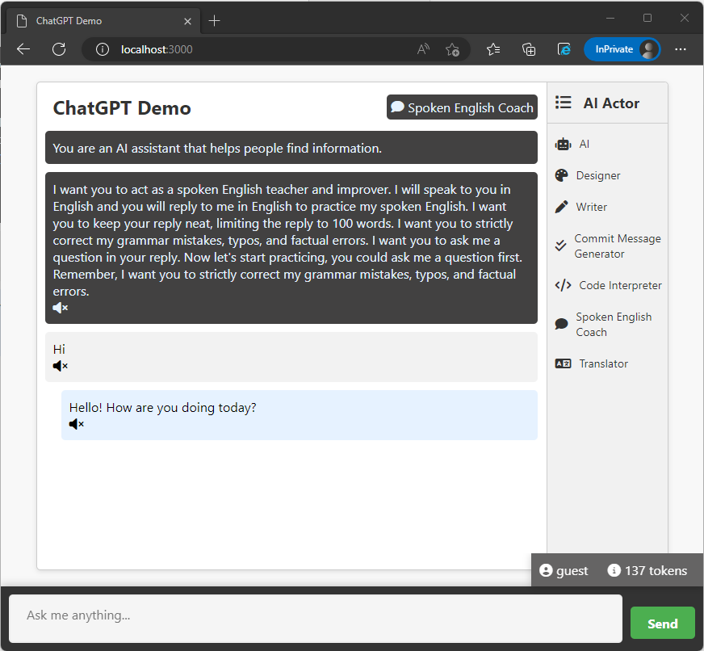
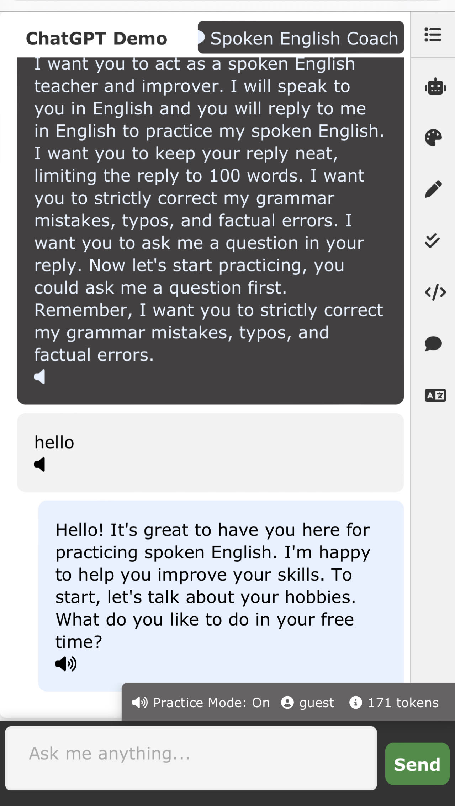

## chatGPTdemo for Azure OpenAI gpt-35-turbo (version 0301)/gpt4 model 🤖

This is a demo chatGPT website built with nodejs and Azure OpenAI gpt-35-turbo (version 0301)/gpt4 model. You can use this code to learn how to use Azure OpenAI API to develop your chatGPT client using Javascript.

## How to run the project 🏃‍♀️
- Clone this project to your local machine.
- Install nodejs.
- Create your .env file
    - You need to create the .env file in the root folder inside this project.
    - Get your API key and endpoint from Azure OpenAI portal.
    - Put the API key and endpoint in the .env file using the following format:

        ```console
        API_KEY=yourapikey

        API_URL=https://$yourendpoint/openai/deployments/$gptmodelname$/chat/completions?api-version=2023-03-15-preview

        ```
    
    - You can add optional parts (not mandatory) to get extra features.
        - PROMPT_REPO_URLS is a JSON object that contains the user name and the URL of the prompt file.
        ```console
        PROMPT_REPO_URLS={"user1":"user1prompts.json", "user2":"user2prompts.json","user3":"user3prompts.json"}
        ```
        For the *user1prompts.json* content format, you may check the file ./public/prompts.json for example.

        - Azure AZURE_TTS is a JSON object that contains the subscriptionKey and the endpoint of the Azure Text-to-Speech service.

        ```console
        AZURE_TTS={"subscriptionKey":"your subscription key","endpoint":"your endpoint"}
        ```


        
## Run command in the terminal 🚀
    npm install
    node server.js

## Open your browser and go to http://localhost:3000 🌐

After running the above commands, open your browser and go to http://localhost:3000 to see the chatGPT demo website like the following image.



