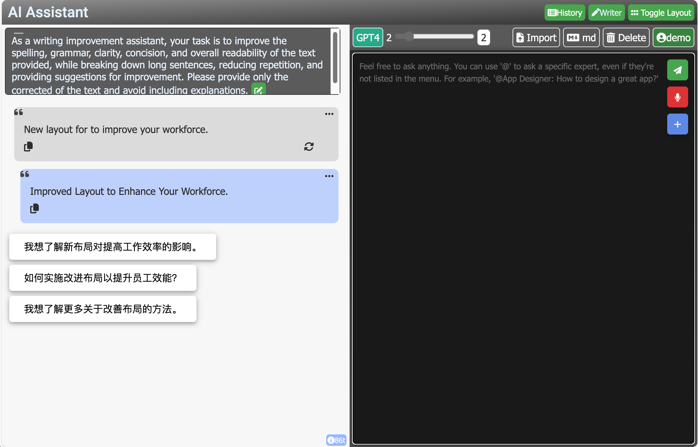
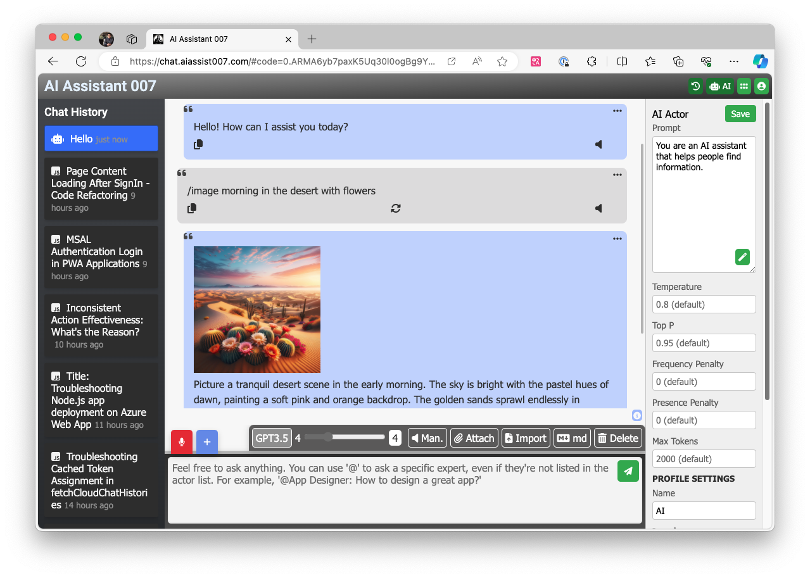
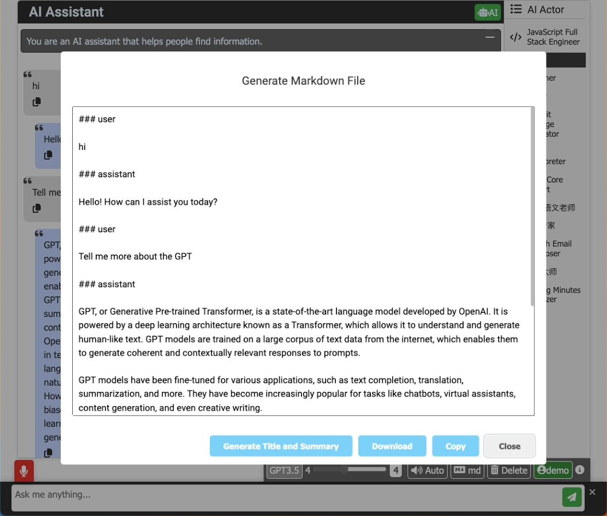
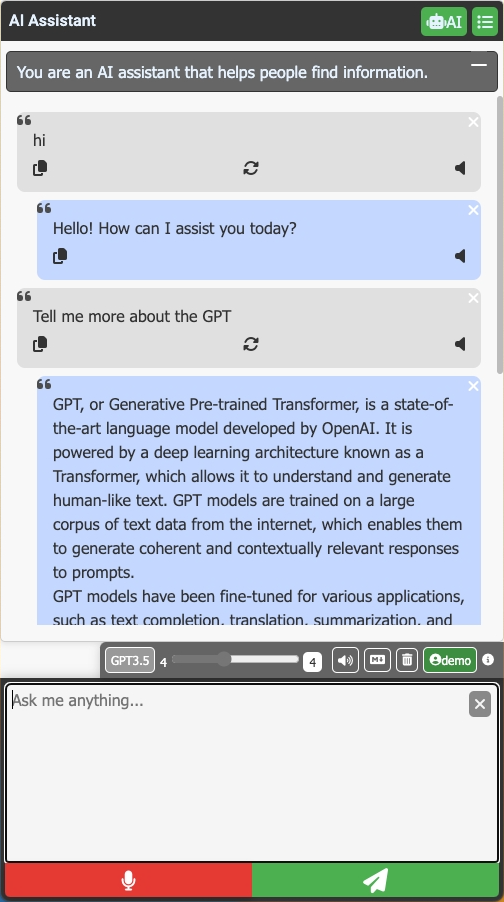

# 🤖 Powerful chatGPT for Azure OpenAI GPT model 

Welcome to Azure chatGPT, a fascinating chatGPT web app built with Node.js and leveraging the Azure OpenAI GPT-3.5-turbo/GPT-4 turbo model/GPT-4 Vision model. This project serves as an excellent starting point for developers interested in developing chatbot applications using JavaScript and the Azure OpenAI API.

## 📺 What's new in the current version
- **Split view for an enhanced conversation experience, especially useful when you need to edit long messages.**


- **Support for syncing conversation to other devices via Azure Table Storage 📡**

- **Generate follow-up questions based on the current conversation 🤔**

## 🌟 Features
- **Full control over messages in your current conversation: delete, hide, or unhide any message, allowing you to influence the AI's memory and enrich your conversations. 💫**


- **Summarize the current conversation and save it to a markdown file 📝**



- **Support for Azure Text-to-Speech engine 📢**
- **Generate images from text using the DALL-E API 🖼️**
- **Support for Speech-to-Text using the Azure Speech-to-Text engine 🎙️**
- **Display actor avatar and name in header when selected**
- **Support for loading system prompt from remote URL**
- **Message formatting preservation**
- **Token counter**
- **Optimized for mobile and tablet devices**


## 🚀 Getting Started

### Prerequisites

- Node.js installed on your local machine.
- An API key and endpoint from the Azure OpenAI portal.

### Installation

1. Clone the project to your local machine.
2. Create a `.env` file in the root folder of the project.
3. Add your API key and endpoint to the `.env` file using the following format:

   ```
   API_KEY=yourgpt35apikey
   API_URL=https://$yourendpoint
   GPT_4_API_KEY=yourgpt4apikey
   GPT_4_API_URL=https://$yourgpt4endpoint
   AZURE_STORAGE_CONNECTION_STRING=your-azure-storage-connection-string
   ```

4. (Optional) Add extra features with `PROMPT_REPO_URLS` and `AZURE_TTS`:
   
   - `PROMPT_REPO_URLS` is a JSON object containing usernames and the URLs of their prompt files:
   
     ```
     PROMPT_REPO_URLS={"user1":"user1prompts.json","user2":"user2prompts.json","user3":"user3prompts.json"}
     ```

   - `AZURE_TTS` is a JSON object containing the subscription key and endpoint for the Azure Text-to-Speech service:

     ```
     AZURE_TTS={"subscriptionKey":"your subscription key","endpoint":"your endpoint"}
     ```
   
   - `API_DALLE_URL` and `API_DALLE_KEY` for DALL-E API service:
   
     ```
     API_DALLE_URL=yourdalleapiurl
     API_DALLE_KEY=yourdalleapikey
     ```
     

5. Continue with Azure AD Configuration. Add the following keys to your `.env` file for authentication. You will need to set up scopes, which are permissions granted to your application to access certain resources on behalf of the user.

   ```
   CLOUD_INSTANCE=https://login.microsoftonline.com/
   TENANT_ID=your-azure-tenant-id
   CLIENT_ID=your-azure-client-id
   CLIENT_SECRET=your-azure-client-secret
   REDIRECT_URI=your-azure-redirect-uri
   POST_LOGOUT_REDIRECT_URI=your-azure-post-logout-redirect-uri
   SCOPES=your-app-api-scope
   GRAPH_API_ENDPOINT=https://graph.microsoft.com/ # The graph API endpoint string should end with a trailing slash
   EXPRESS_SESSION_SECRET=Enter_the_Express_Session_Secret_Here
   ```

   To set up `SCOPES`:

   - Login to the [Azure Portal](https://portal.azure.com).
   - Navigate to `Azure Active Directory` > `App registrations` and select your application.
   - In the `Expose an API` section, click on `Add a scope`. Here you will define the permissions your application requires.
   - Follow the instructions in the portal to add the scopes you need. For example, for accessing the Microsoft Graph API, you might add a scope like `user.read`.
   - Once your scopes are created, note down the full URI of the scope, it will look something like `api://<your-application-client-id>/access_as_user` for a custom API or `https://graph.microsoft.com/User.Read` for a Microsoft service like Graph API.
   - In your `.env` file, set the `SCOPES` variable to these values. If specifying multiple scopes, separate them by spaces.

   **Important**: Ensure the `SCOPES` format aligns with what your application's functionalities require. For backend access, it would typically be `api://<Application (client) ID>/<scope-name>`. For Microsoft Graph, it can be a URL like `https://graph.microsoft.com/.default` or specific permissions like `https://graph.microsoft.com/User.Read`.
  
   **Note**: The exact `scope` string is critical for the correct operation of OAuth and OpenID Connect flows. Misconfiguration can result in authorization errors.

6. Install the necessary packages:

   ```
   npm install
   ```

7. Start the server:

   ```
   npm start
   ```

8. Open your browser and visit [http://localhost:3000](http://localhost:3000) to enjoy the chatGPT for your own!

Now you're all set to explore and develop your chatbot application using JavaScript and the Azure OpenAI API. Happy coding! 🎉
