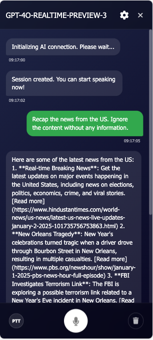

# 🤖 Powerful chatGPT for Azure OpenAI GPT model 

Welcome to Azure chatGPT, a fascinating chatGPT web app built with Node.js and leveraging the Azure OpenAI GPT-4o-realtime/o1/o1-mini/o3-mini/o4-mini/GPT-4O/GPT-4O-mini/GPT-4.5-preview/GPT-4.1/GPT-4.1-nano/GPT-4.1-mini model. This project serves as an excellent starting point for developers interested in developing chatbot applications using JavaScript and the Azure OpenAI API.

## 📚 Learnings from this Project

By working on this project, you will gain hands-on experience with several key APIs and services, including:

- **Azure OpenAI API**: Learn how to integrate and utilize various GPT models, such as GPT-4o, GPT-4o-mini, and GPT-4o-realtime, to build intelligent conversational agents.
- **Azure Speech Service**: Understand how to implement both Text-to-Speech and Speech-to-Text functionalities to enhance user interactions with voice capabilities.
- **Azure Table Storage**: Discover how to sync and store conversation data across devices, ensuring a seamless user experience.
- **Bing API**: Explore how to fetch and display the latest news updates within your chatbot application.
- **DALL-E API**: Learn to generate images from text inputs, adding a visual dimension to your chatbot's responses.
- **Azure AD Authentication**: Gain insights into securing your web application using Azure Active Directory, managing user authentication, and protecting sensitive data.

These learnings will equip you with the skills to build robust, feature-rich chatbot applications leveraging the power of Azure's AI and cloud services.

## 📺 What's new in the current version


- **🎉Support for GPT-4o Realtime Chat - enabling real-time voice conversations with gpt-4o-realtime-preview-3🎉**


- **🎉Support for o1/o1-mini/o3-mini/o4-mini/GPT-4O/GPT-4O-mini/GPT-4.5-preview/GPT-4.1/GPT-4.1-nano/GPT-4.1-mini🎉**
- **✨Support PWA (Progressive Web App)✨**


- **🎉Support for Bing API - Get the latest news updates through API integration🎉**
- **🎉Support question generation mode - enhances conversation quality by automatically generating structured options to guide your inquiries, leading to higher quality AI responses. When enabled, each of your questions will include multiple focused options to choose from, helping you get more precise and relevant answers.🎉**

- **Split view for an enhanced conversation experience, especially useful when you need to edit long messages.**

- **🎉Support Azure AD authentication to protect your web app🎉**
- **Support for syncing conversation to other devices via Azure Table Storage 📡**

- **Generate follow-up questions based on the current conversation 🤔**
- **Support Azure Speech Service batch transcription with REST API v3.2(Whisper model) support 🎙️**

## 🌟 Features
- **Full control over messages in your current conversation: delete, hide, or unhide any message, allowing you to influence the AI's memory and enrich your conversations. 💫**


- **Summarize the current conversation and save it to a markdown file 📝**


- **Support for Azure Text-to-Speech engine 📢**
- **Generate images from text using the DALL-E API 🖼️**
- **Support for Speech-to-Text using the Azure Speech-to-Text engine 🎙️**
- **Display actor avatar and name in header when selected**
- **Support for loading system prompt from remote URL**
- **Message formatting preservation**
- **Token counter**
- **Optimized for mobile and tablet devices**

## 🚀 Getting Started

### Prerequisites

- Node.js installed on your local machine.
- An API key and endpoint from the Azure OpenAI portal.

### Installation

1. Clone the project to your local machine.
2. Create a `.env` file in the root folder of the project.
3. Add your API key and endpoint to the `.env` file using the following format:

   ```
   GPT_4O_API_URL=https://yourserver.openai.azure.com/openai/deployments/gpt-4o/chat/completions?api-version=2024-08-01-preview
   GPT_4O_API_KEY=your-gpt4o-key
   GPT_4O_MINI_API_URL=https://yourserver.openai.azure.com/openai/deployments/gpt-4o-mini/chat/completions?api-version=2024-08-01-preview
   GPT_4O_MINI_API_KEY=your-gpt4o-mini-key
   O1_MINI_API_URL=https://yourserver.openai.azure.com/openai/deployments/o1-mini/chat/completions?api-version=2024-12-01-preview
   O1_MINI_API_KEY=your-o1-mini-key
   O1_API_URL=https://yourserver.openai.azure.com/openai/deployments/o1-preview/chat/completions?api-version=2024-12-01-preview
   O1_API_KEY=your-o1-key
   GPT_4O_REALTIME_API_URL=https://yourserver.openai.azure.com/openai/realtime?api-version=2024-10-01-preview&deployment=yourdeployment
   GPT_4O_REALTIME_API_KEY=your-gpt4o-realtime-key
   GPT_4O_REALTIME_DEPLOYMENT=yourdeployment
   AZURE_STORAGE_CONNECTION_STRING=your-azure-storage-connection-string
   ```

4. (Optional) Add extra features with `AZURE_TTS`:

   - `AZURE_TTS` is a JSON object containing the subscription key and endpoint for the Azure Text-to-Speech service:

     ```
     AZURE_TTS={"subscriptionKey":"your subscription key","endpoint":"your endpoint"}
     ```
   
   - `API_DALLE_URL` and `API_DALLE_KEY` for DALL-E API service:
   
     ```
     API_DALLE_URL=yourdalleapiurl
     API_DALLE_KEY=yourdalleapikey
     ```
     

5. Continue with Azure AD Configuration. Add the following keys to your `.env` file for authentication. You will need to set up scopes, which are permissions granted to your application to access certain resources on behalf of the user.

   ```
   CLOUD_INSTANCE=https://login.microsoftonline.com/
   TENANT_ID=your-azure-tenant-id
   CLIENT_ID=your-azure-client-id
   CLIENT_SECRET=your-azure-client-secret
   REDIRECT_URI=your-azure-redirect-uri
   POST_LOGOUT_REDIRECT_URI=your-azure-post-logout-redirect-uri
   SCOPES=your-app-api-scope
   GRAPH_API_ENDPOINT=https://graph.microsoft.com/ # The graph API endpoint string should end with a trailing slash
   EXPRESS_SESSION_SECRET=Enter_the_Express_Session_Secret_Here
   ```

   To set up `SCOPES`:

   - Login to the [Azure Portal](https://portal.azure.com).
   - Navigate to `Azure Active Directory` > `App registrations` and select your application.
   - In the `Expose an API` section, click on `Add a scope`. Here you will define the permissions your application requires.
   - Follow the instructions in the portal to add the scopes you need. For example, for accessing the Microsoft Graph API, you might add a scope like `user.read`.
   - Once your scopes are created, note down the full URI of the scope, it will look something like `api://<your-application-client-id>/access_as_user` for a custom API or `https://graph.microsoft.com/User.Read` for a Microsoft service like Graph API.
   - In your `.env` file, set the `SCOPES` variable to these values. If specifying multiple scopes, separate them by spaces.

   **Important**: Ensure the `SCOPES` format aligns with what your application's functionalities require. For backend access, it would typically be `api://<Application (client) ID>/<scope-name>`. For Microsoft Graph, it can be a URL like `https://graph.microsoft.com/.default` or specific permissions like `https://graph.microsoft.com/User.Read`.
  
   **Note**: The exact `scope` string is critical for the correct operation of OAuth and OpenID Connect flows. Misconfiguration can result in authorization errors.

6. Replace the following placeholders in the `utils/authConfig.js` file:

```
const cloudInstance = "https://login.microsoftonline.com/";
const tenantId = "a5fb26eb-4aac-4ae5-b7d2-****";
const scopes = "api://812a857f-f189-4aeb-b086-*****/user_impersonation";
const clientId = "812a857f-f189-4aeb-b086-";
const redirectUri = "https://chat.aiassist007.com/";
```
with your Azure AD configuration.

Why am I not putting this in the `.env` file? Because I encountered some issues with the `authConfig.js` file when I placed the values in the `.env` file. I also need to insert the values in GitHub actions for my CI/CD pipeline. It does not work well with the CI pipeline; sometimes it works, and other times it does not (It will be replaced with MISSING_ENV_VARIABLES). If you have any suggestions to fix this issue, please let me know. Thank you!

7. Install the necessary packages:

   ```
   npm install
   ```

8. Start the server:

   ```
   npm start
   ```

9. Open your browser and visit [http://localhost:3000](http://localhost:3000) to enjoy the chatGPT for your own!

## 📊 Profile Migration to Azure Table Storage（For user from older version)

This project now supports storing AI profiles in Azure Table Storage instead of JSON files. To migrate your existing profiles, follow these steps:

### Prerequisites

- Make sure your Azure Storage Connection String is correctly set in the `.env` file:
  ```
  AZURE_STORAGE_CONNECTION_STRING=your-azure-storage-connection-string
  ```

### Migration Options

#### Option 1: Use the Migration Script

For migrating a specific user's profile:

```bash
# Migrate a specific user's profile
node scripts/runMigration.js yourusername@example.com
```

#### Option 2: Migrate All Profiles

If you want to migrate all user profiles:

```bash
# Migrate all user profiles from .data directory
node scripts/migrateProfilesToAzure.js --all
```

#### Option 3: Programmatic Migration

You can also trigger the migration programmatically:

```javascript
const { initProfileMigration } = require('./services/profileMigrationInit');

// Migrate a specific user's profile
await initProfileMigration('yourusername@example.com');
```

### Table Structure

The AI profiles are stored in Azure Table Storage with the following structure:

- **Table name**: `AIProfiles`
- **Partition key**: Username (email)
- **Row key**: Profile name
- **Properties**:
  - `profileData`: Complete profile JSON (stringified)
  - `sortedIndex`: Profile's sort order (extracted for easier filtering)
  - `description`: Profile description (extracted for easier filtering)
  - `timestamp`: Last update time

### Verification

After migration, you can verify the data has been correctly migrated by:
- Checking the Azure Storage Explorer for the `AIProfiles` table
- Logging in to the application and confirming all your profiles are available

Now you're all set to explore and develop your chatbot application using JavaScript and the Azure OpenAI API. Happy coding! 🎉
