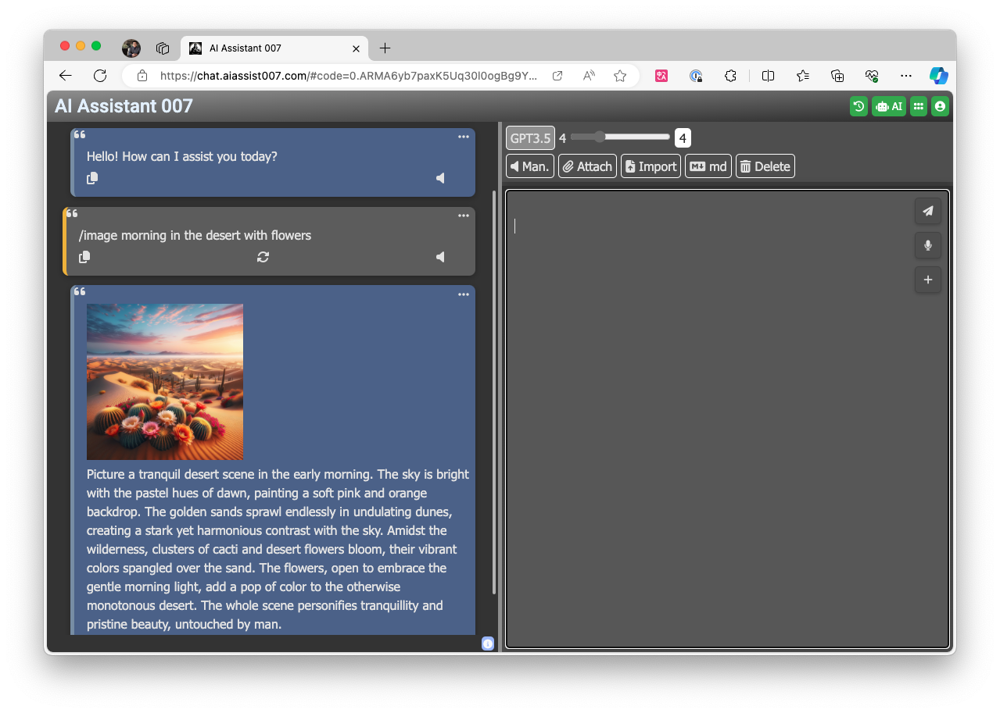
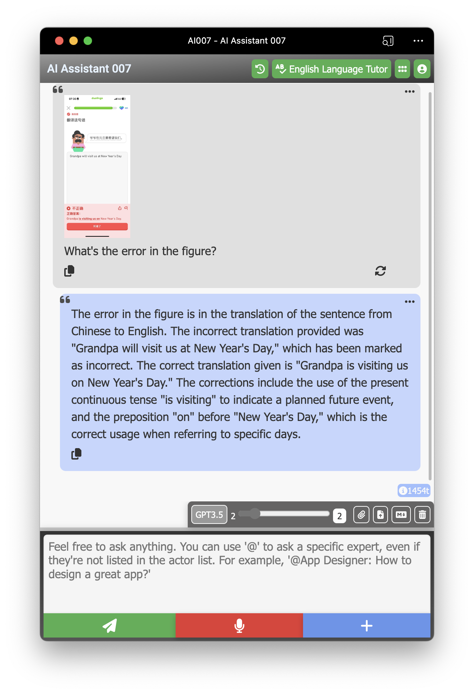
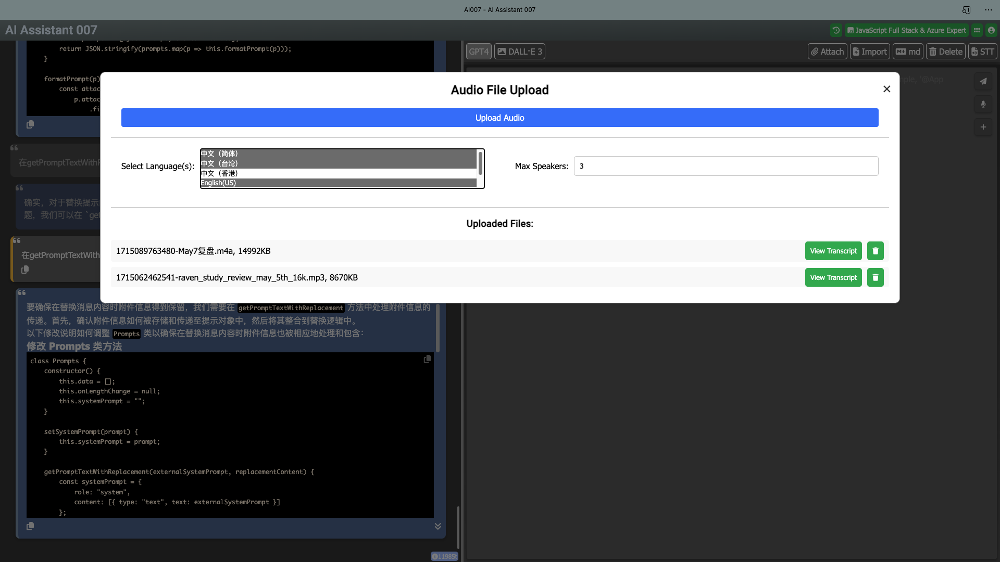

# 🤖 强大的 Azure OpenAI GPT 模型 chatGPT 与 Sora 视频生成

欢迎使用 Azure chatGPT，这是一个基于 Node.js 构建的迷人 chatGPT 网络应用，利用最新的 Azure OpenAI 模型，包括 **GPT-5 系列**（gpt-5、gpt-5-mini、gpt-5-nano、gpt-5-chat）、**O系列推理模型**（o3、o3-mini、o4-mini）、GPT-4o-realtime/o1/o1-mini/GPT-4O/GPT-4O-mini/GPT-4.1 系列，并增强了尖端的 Sora AI 视频生成功能。该项目为对使用 JavaScript、Azure OpenAI API 和高级视频生成功能开发综合 AI 应用程序感兴趣的开发者提供了一个绝佳的起点。

## 📚 项目学习收获

通过这个项目，您将获得几个关键 API 和服务的实践经验，包括：

- **Azure OpenAI API**：学习如何集成和利用各种先进的 GPT 模型，包括 **GPT-5 系列**（gpt-5、gpt-5-mini、gpt-5-nano、gpt-5-chat）、**O系列推理模型**（o3、o3-mini、o4-mini）、GPT-4o、GPT-4o-mini、GPT-4o-realtime 和 GPT-4.1 系列，构建具有尖端功能的智能对话代理。
- **Sora 视频生成 API**：掌握高级 AI 视频生成功能，包括文本转视频、作业管理和异步处理工作流。

- **Azure 语音服务**：了解如何实现文本转语音和语音转文本功能，通过语音功能增强用户交互。
- **Azure 表存储**：探索如何跨设备同步和存储对话数据，确保无缝的用户体验。
- **Bing API**：探索如何在聊天机器人应用程序中获取和显示最新新闻更新。
- **GPT-Image API**：学习使用最新的 GPT-Image 模型从文本输入生成和编辑图像，为聊天机器人的响应添加视觉维度。
- **Azure AD 身份验证**：深入了解使用 Azure Active Directory 保护您的网络应用程序，管理用户身份验证和保护敏感数据。

这些学习将使您具备构建强大、功能丰富的聊天机器人应用程序的技能，充分利用 Azure 的 AI 和云服务的力量。

## 📺 当前版本新功能

- **🎬 新功能：Sora AI 视频生成 - 使用 OpenAI 尖端的 Sora 模型从文本描述创建惊人的视频！🎬**

- **🎉支持 GPT-5 系列 - 最新推理模型，具备增强功能：gpt-5、gpt-5-mini、gpt-5-nano、gpt-5-chat🎉**
- **🎉支持 O系列模型 - 高级推理能力：o3、o3-mini、o4-mini🎉**
- **🎙️增强版实时语音聊天 - 提供 gpt-realtime 与 gpt-realtime-mini 双模型、即时切换、8 种语音以及扬声器静音控制🎙️**
- **✨支持 PWA（渐进式网络应用程序）✨**




- **🎉支持 Bing API - 通过 API 集成获取最新新闻更新🎉**
- **🎉支持问题生成模式 - 通过自动生成结构化选项来指导您的询问，提高对话质量，获得更高质量的 AI 响应。启用后，您的每个问题都将包含多个专注选项供您选择，帮助您获得更精确和相关的答案。🎉**

- **分屏视图提供增强的对话体验，特别适用于需要编辑长消息的情况。**

- **🎉支持 Azure AD 身份验证保护您的网络应用程序🎉**
- **支持通过 Azure 表存储将对话同步到其他设备 📡**

- **根据当前对话生成后续问题 🤔**
- **支持 Azure 语音服务批量转录，支持 REST API v3.2（Whisper 模型）🎙️**

## 🎬 Sora 视频生成功能

**🎉 新功能：使用 OpenAI Sora 的高级 AI 视频生成 🎉**

该应用程序现在包含由 OpenAI 的 Sora 模型驱动的强大视频生成功能，允许您从文本描述创建高质量视频。

### 主要 Sora 功能：
- **文本转视频生成**：将详细的文本提示转换为令人惊叹的视频内容。
- **AI 提示重写**：使用 AI 完善和增强您的视频提示，确保最佳结果。
- **高质量输出**：生成具有令人印象深刻的视觉保真度和运动连贯性的视频。
- **灵活持续时间**：创建具有可定制长度和纵横比的视频。
- **高级控制**：微调视频参数，包括样式、运动和视觉元素。
- **进度跟踪**：实时监控视频生成进度。
- **下载和管理**：简单的视频下载和管理，具有有组织的存储。

### Sora 集成亮点：
- **无缝 UI 集成**：直接在聊天界面中访问 Sora 视频生成
- **作业管理**：同时跟踪多个视频生成作业
- **错误处理**：具有详细反馈的强大错误处理
- **文件组织**：自动视频文件组织和存储管理
- **移动优化**：移动设备上提供完整的 Sora 功能

### 视频生成工作流程：
1. **输入提示**：提供所需视频的详细文本描述
2. **配置设置**：调整视频参数（持续时间、纵横比、质量）
3. **生成**：将作业提交到 Sora API 进行处理
4. **监控进度**：实时跟踪生成状态
5. **下载**：访问和下载完成的视频

## 🌟 功能特性
- **完全控制当前对话中的消息：删除、隐藏或取消隐藏任何消息，允许您影响 AI 的记忆并丰富您的对话。💫**

- **总结当前对话并将其保存为 markdown 文件 📝**


- **支持 Azure 文本转语音引擎 📢**
- **增强版实时语音聊天：双 GPT Realtime 模型、八种语音选择、会话级扬声器静音控制 🔊**
- **使用 GPT-Image API 从文本生成和编辑图像 🖼️✏️**
- **支持使用 Azure 语音转文本引擎的语音转文本 🎙️**
- **在选择时在标题中显示角色头像和姓名**
- **支持从远程 URL 加载系统提示**
- **消息格式保留**
- **令牌计数器**
- **针对移动和平板设备优化**

## 🚀 快速开始

### 前提条件

- 在本地机器上安装 Node.js。
- 从 Azure OpenAI 门户获取 API 密钥和端点。

### 安装

1. 将项目克隆到本地机器。
2. 在项目根文件夹中创建 `.env` 文件。
3. 使用以下格式将您的 API 密钥和端点添加到 `.env` 文件：

   ```
   GPT_4O_API_URL=https://yourserver.openai.azure.com/openai/deployments/gpt-4o/chat/completions?api-version=2024-08-01-preview
   GPT_4O_API_KEY=your-gpt4o-key
   GPT_4O_MINI_API_URL=https://yourserver.openai.azure.com/openai/deployments/gpt-4o-mini/chat/completions?api-version=2024-08-01-preview
   GPT_4O_MINI_API_KEY=your-gpt4o-mini-key
   O1_MINI_API_URL=https://yourserver.openai.azure.com/openai/deployments/o1-mini/chat/completions?api-version=2024-12-01-preview
   O1_MINI_API_KEY=your-o1-mini-key
   O1_API_URL=https://yourserver.openai.azure.com/openai/deployments/o1-preview/chat/completions?api-version=2024-12-01-preview
   O1_API_KEY=your-o1-key
   # GPT Realtime（双模型支持）
   GPT_REALTIME_API_URL=wss://yourserver.openai.azure.com/openai/realtime?api-version=2024-10-01-preview&deployment=gpt-realtime
   GPT_REALTIME_API_KEY=your-gpt-realtime-key
   GPT_REALTIME_MINI_API_URL=wss://yourserver.openai.azure.com/openai/realtime?api-version=2024-10-01-preview&deployment=gpt-realtime-mini
   GPT_REALTIME_MINI_API_KEY=your-gpt-realtime-mini-key
   AZURE_STORAGE_CONNECTION_STRING=your-azure-storage-connection-string
   
   # Sora 视频生成配置
   SORA_API_URL=https://yourserver.openai.azure.com/openai/deployments/sora/video/generations/jobs?api-version=2025-02-15-preview
   SORA_API_KEY=your-sora-api-key
   ```

4. （可选）使用 `AZURE_TTS` 添加额外功能：

   - `AZURE_TTS` 是包含 Azure 文本转语音服务的订阅密钥和端点的 JSON 对象：

     ```
     AZURE_TTS={"subscriptionKey":"your subscription key","endpoint":"your endpoint"}
     ```
   
   - `GPT_IMAGE_1_API_URL` 和 `GPT_IMAGE_1_API_KEY` 用于 GPT-Image API 服务：
   
     ```
     GPT_IMAGE_1_API_URL=https://yourserver.cognitiveservices.azure.com/openai/deployments/gpt-image-1/images/generations?api-version=2025-04-01-preview
     GPT_IMAGE_1_API_KEY=your-gpt-image-1-key
     ```

   - **Sora 视频生成配置**：要启用高级视频生成功能，请添加您的 Sora API 凭据：

     ```
     SORA_API_URL=https://yourserver.openai.azure.com/openai/deployments/sora/video/generations/jobs?api-version=2025-02-15-preview
     SORA_API_KEY=your-sora-api-key
     ```

     **Sora 设置重要说明**：
     - 确保您的 Azure OpenAI 部署包含 Sora 模型访问权限
     - Sora API 使用最新的预览 API 版本（2025-02-15-preview）
     - 视频生成需要大量处理时间 - 作业是异步处理的

5. 继续进行 Azure AD 配置。将以下密钥添加到您的 `.env` 文件进行身份验证。您需要设置范围，这是授予您的应用程序代表用户访问某些资源的权限。

   ```
   CLOUD_INSTANCE=https://login.microsoftonline.com/
   TENANT_ID=your-azure-tenant-id
   CLIENT_ID=your-azure-client-id
   CLIENT_SECRET=your-azure-client-secret
   REDIRECT_URI=your-azure-redirect-uri
   POST_LOGOUT_REDIRECT_URI=your-azure-post-logout-redirect-uri
   SCOPES=your-app-api-scope
   GRAPH_API_ENDPOINT=https://graph.microsoft.com/ # graph API 端点字符串应以斜杠结尾
   EXPRESS_SESSION_SECRET=Enter_the_Express_Session_Secret_Here
   ```

6. 安装必要的包：

   ```
   npm install
   ```

7. 启动服务器：

   ```
   npm start
   ```

8. 打开浏览器并访问 [http://localhost:3000](http://localhost:3000) 享受您自己的 chatGPT！

## 🎬 使用 Sora 视频生成

配置 Sora API 凭据后，您可以开始生成视频：

### 访问 Sora 功能：
1. **通过聊天界面**：在聊天界面中寻找视频生成选项
2. **Sora 工作室**：通过 Sora 工作室界面访问专用视频生成工具
3. **直接集成**：在对话流程中直接使用 Sora 功能

### 视频生成过程：
1. **输入描述**：提供所需视频的详细文本描述
2. **设置参数**：配置视频设置（持续时间、纵横比、质量级别）
3. **提交请求**：启动视频生成作业
4. **监控进度**：使用实时更新跟踪生成状态
5. **下载结果**：生成完成后访问您的完成视频

### Sora 提示最佳实践：
- **详细描述**：包含详细的视觉描述、镜头运动和场景元素
- **指定风格**：提及艺术风格、照明、情绪和氛围
- **包含运动**：描述所需的运动、过渡和动态元素
- **设置上下文**：提供场景设置、一天中的时间、环境细节

### Sora 提示示例：
```
"日出时宁静的山湖，水面有轻柔的涟漪，金光反射在峰顶上，一艘小木船缓慢漂过画面"

"夜晚繁忙的赛博朋克城市街道，霓虹招牌、飞行汽车和雨水在湿润路面上创造彩色反射，电影宽镜头"

"花园中盛开花朵的特写，延时风格，带有晨露水滴和柔和自然光线，微距摄影美学"
```

### 生成视频管理：
- 视频自动保存到 `public/generated-videos/` 目录
- 每个视频包含元数据和生成参数
- 通过网络界面直接下载视频
- 使用内置管理系统按项目或主题组织视频

## 📊 配置文件迁移到 Azure 表存储（适用于旧版本用户）

该项目现在支持将 AI 配置文件存储在 Azure 表存储中，而不是 JSON 文件。要迁移现有配置文件，请按照以下步骤操作：

### 前提条件

- 确保您的 Azure 存储连接字符串在 `.env` 文件中正确设置：
  ```
  AZURE_STORAGE_CONNECTION_STRING=your-azure-storage-connection-string
  ```

### 迁移选项

#### 选项 1：使用迁移脚本

迁移特定用户的配置文件：

```bash
# 迁移特定用户的配置文件
node scripts/runMigration.js yourusername@example.com
```

#### 选项 2：迁移所有配置文件

如果您想迁移所有用户配置文件：

```bash
# 从 .data 目录迁移所有用户配置文件
node scripts/migrateProfilesToAzure.js --all
```

现在您已准备好探索和开发使用 JavaScript 和 Azure OpenAI API 的聊天机器人应用程序。祝编程愉快！🎉

---

## 🌐 Language / 语言

- [English](README.md)
- [中文](README.zh-CN.md)
- [在线演示 / Live Demo](https://hddevteam.github.io/Azure-chatGPT-demo/)
- [中文在线演示](https://hddevteam.github.io/Azure-chatGPT-demo/zh-cn/)
